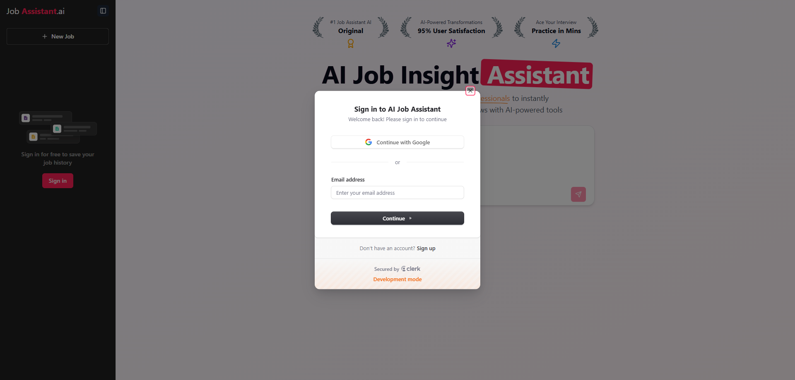
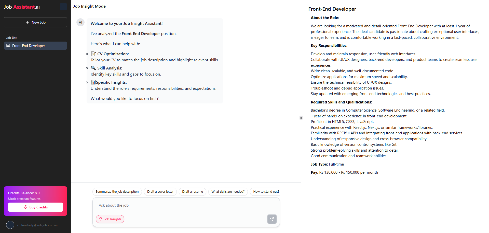

# AI Job Assistant

A powerful AI-powered job assistant built with modern technologies to help streamline your job hunting process.

## 🚀 Features

- **AI-Powered Job Search**
  - Smart job recommendations based on your Pasted Jobs
  - Automated job application assistance
  - Resume optimization suggestions
  - Cover letter generation

- **Authentication & Security**
  - Secure user authentication with Clerk
  - Protected routes and API endpoints
  - User profile management

- **Real-time Database**
  - Powered by Convex for real-time updates
  - Efficient data synchronization
  - Reliable data persistence

- **Payment Integration**
  - Secure payment processing with PayPal
  - Subscription management
  - Premium feature access

- **AI Integration**
  - Powered by Google Gemini API
  - Intelligent job matching
  - Smart content generation
  - Natural language processing

## 🛠️ Tech Stack

- **Frontend**
  - Next.js 14 (App Router)
  - Tailwind CSS
  - Shadcn UI Components

- **Backend**
  - Convex (Real-time Database)
  - Clerk (Authentication)
  - Google Gemini API
  - PayPal API

## 📸 Screenshots

*Authentication*

*Job Details*

